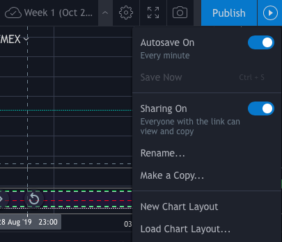

# TradingView Chart Screenshot bot
*bot by mrlock13

This bot allows you to capture any public chart available in TradingView.

### Requirement
Download chromedriver binary file and locate the file location in **tvss.py**.<br />
[chromedriver](https://chromedriver.chromium.org)

### Install
```bash
git clone https://github.com/mrlock13/TradingView-SSBot.git
pip install -r requirement.txt
```

### Setup
Go to your chart setting in TradingView and set the sharing setting to public.<br />Then put the link to the chart inside ***tvss.py***.<br />


### Usage
```bash
python tvss.py
```  
[chart](GFAAoy4g.png)

### Additional function
Uncomment row 24 to 28 to rename the chart with timestamp and move chart to desired location.
